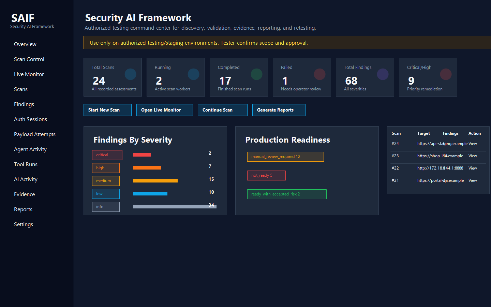
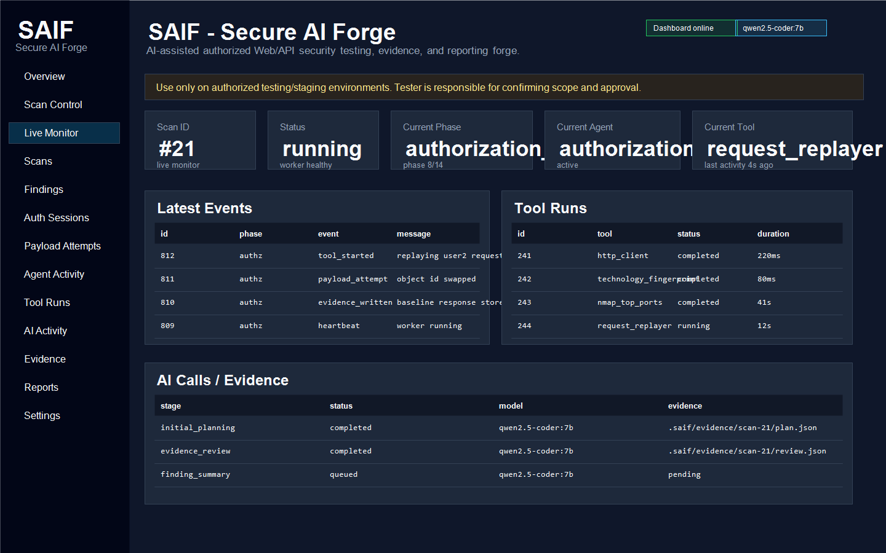
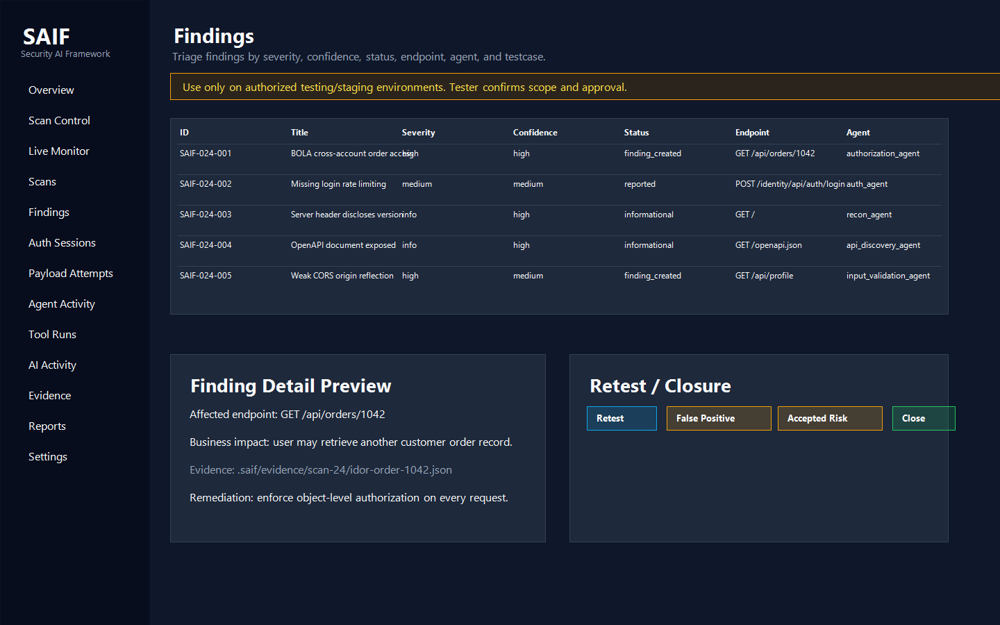
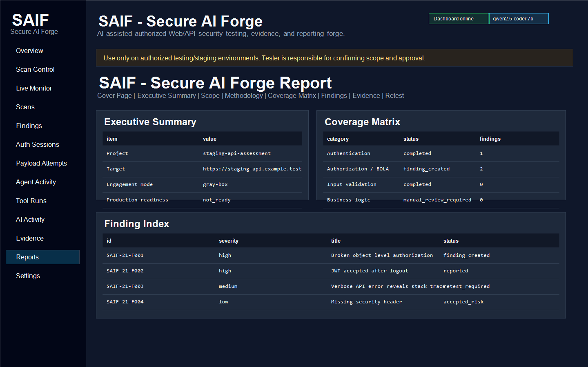

# SAIF - Secure AI Forge


AI-assisted authorized Web/API security testing, evidence, and reporting forge.

> SAIF is in development. Use only on authorized testing, staging, lab, or non-production environments. The tester is responsible for confirming scope, approval, and the impact of every test.
>
> Google also uses SAIF to refer to Secure AI Framework. This project uses SAIF as Secure AI Forge and is independent and not affiliated with Google.

## What Is SAIF?

SAIF - Secure AI Forge is a local dashboard-driven security testing platform. It combines deterministic Web/API discovery, tool orchestration, PostgreSQL-backed evidence storage, Ollama-assisted planning/review, and HTML/JSON reporting.

SAIF is designed to support black-box and gray-box Web/API testing today. Source-assisted white-box workflows may be added later when useful.

## Why SAIF?

Modern API security work needs more than a basic scanner. SAIF tracks projects, scans, agents, tool runs, AI calls, evidence, payload attempts, findings, reports, and retest workflow in one local control plane.

## Current Development Status

SAIF is still in development. Changes, fixes, and new features will be uploaded as the project evolves and as time permits. It is not yet a replacement for a professional tester. AI output must be reviewed by a human. Do not use SAIF against targets without written authorization.

Mature foundation:
- [x] Local dashboard
- [x] PostgreSQL and Alembic foundation
- [x] Tool registry
- [x] Web/API discovery foundation
- [x] Evidence storage
- [x] JSON/HTML report foundation

In development:
- [ ] Full authenticated authorization workflow
- [ ] Network/host modules
- [ ] DOCX/PDF reports
- [ ] Advanced SSO/manual session support
- [ ] Full plugin system

## Features

- Dashboard command center for scan start, live monitoring, pause/resume/stop, phase continuation, evidence, findings, and reports.
- AI-required scan planning with Ollama.
- Deterministic evidence-first execution model.
- Web/API discovery, OpenAPI discovery, auth endpoint mapping, method probing, technology fingerprinting, and application profile detection including crAPI.
- PostgreSQL storage for scans, events, tools, evidence, AI calls, payload attempts, findings, and reports.
- Destructive testing policy controls.
- Professional report structure with coverage matrix, evidence appendix, remediation, and retest sections.

## Dashboard Screenshots

Example screenshots use representative data so the dashboard/reporting flow is visible without publishing real engagement evidence.

- 
- 
- 
- 
- 

## Supported Testing Modes

- **black-box:** target URL only; public discovery, API inventory, auth discovery, method probing, and unauthenticated checks.
- **gray-box:** target plus credentials/test accounts/API keys; authenticated crawling, session/JWT testing, authorization matrix, BOLA/IDOR, BFLA, and business logic where prerequisites exist.
- **white-box:** optional future/source-assisted mode for endpoint discovery and remediation suggestions. Source code access is optional and never assumed.

## Supported Targets

- Web/API applications
- crAPI lab
- Generic REST APIs
- Network/host testing modules in development

## AI/Ollama Role

Ollama helps with planning, evidence review, payload strategy, impact explanation, remediation language, and next-test recommendations. SAIF keeps deterministic evidence as the source of truth. AI must not invent findings without baseline/attack evidence.

## Anti-Hallucination Design

SAIF stores tool runs, raw evidence, structured findings, AI call records, and consistency checks. Reports should prefer structured evidence when AI review contradicts observed facts.

## Installation

```bash
git clone https://github.com/shahidshaik786/SecureAIForge_saif.git
cd SecureAIForge_saif
cp .env.example .env
./saif.sh setup
./saif.sh init-db
```

PostgreSQL is required from day one. SQLite is not supported.

## Quick Start

```bash
./saif.sh doctor --target http://127.0.0.1:8888
./saif.sh dashboard start
```

Open:

```text
http://127.0.0.1:8787
```

## Start Full Authorized Web/API Test

Use the dashboard Scan Control page, or CLI for debugging:

```bash
./saif.sh scan start \
  --target http://127.0.0.1:8888 \
  --profile crapi \
  --mode gray-box \
  --full \
  --destructive-policy lab_full_allowed \
  --confirm-destructive-testing \
  --debug
```

In this example `--profile crapi` is the application profile. The execution profile is selected separately through `--full`, `--destructive-policy`, and dashboard execution controls.

## Destructive Testing Policy

SAIF supports these policies:

- `disabled`
- `detect_only`
- `test_owned_only`
- `manual_confirmation`
- `lab_full_allowed` / **Destructive Test Cases - Full Authorized Scan**

Use destructive modes only in lab, staging, or explicitly approved environments. See [docs/destructive-testing-policy.md](docs/destructive-testing-policy.md).

## Reports

Reports currently generate JSON and HTML. DOCX/PDF are planned. Report sections include executive summary, scope, methodology, coverage matrix, findings, evidence, remediation, and retest/closure.

## Project Structure

```text
saif/                 Python package
saif/dashboard/       FastAPI/Jinja dashboard
saif/services/        orchestration, reporting, tool management
saif/db/              SQLAlchemy models and session
alembic/versions/     PostgreSQL migrations
configs/testcases/    YAML test case registries
configs/profiles/     target profiles
docs/                 usage and development documentation
examples/             sample credentials and scan configs
```

## Tests

```bash
.venv/bin/python -m unittest discover tests
./saif.sh doctor --target http://127.0.0.1:8888
```

## Disclaimer

SAIF is designed for authorized testing environments only. It does not decide whether a tester is legally allowed to test a system. The tester must confirm scope, authorization, and environment before execution. The author does not accept responsibility for misuse, unauthorized testing, service disruption, data loss, legal issues, or any activity performed with this tool.

## Author / Maintainer

Author and maintainer: Galib Shahid Shaik.
